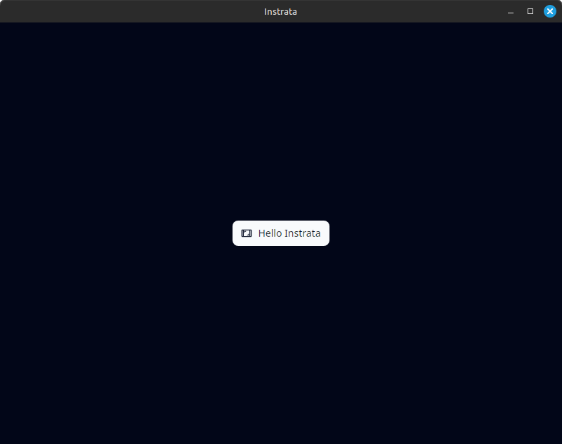

# instrata

> Instrata is a tool for creating step-by-step guides from automatic screenshots.  

<!-- [] -->

## Why Instrata

Instrata helps users quickly document processes and workflows without manually capturing or organizing screenshots. It automatically captures relevant screenshots, allowing you to annotate, highlight, or blur content, and compile them into guides suitable for sharing, reporting, or internal documentation. This saves time and improves clarity when creating step-by-step instructions.

## Key Features

- Automatic screenshot capture for step-by-step guides
- Multi-format export: images, Markdown, HTML, PDF, JSON project files
- Simple image editing: blur, highlight, text, basic adjustments
- Hotkeys and system tray support
- Minimalist, modern UI
- Focused on ease-of-use and workflow efficiency

## Installation

Download the latest release for your platform from [GitHub Releases](https://github.com/instrata/instrata/releases).

**Linux:** AppImage, `.deb`, `.rpm`  
**Windows:** `.msi` or `-setup.exe`  
**MacOS:** currently not distributed due to lack of testing

## Samples

Instrata comes with sample guides to help you get started quickly. Check the [sample guides directory](README.assets/sample-guides) for ready-to-use examples and inspiration.

## Roadmap

- [ ] Enhanced annotation tools (arrows, shapes, stickers)
- [ ] Hotkey customization
- [ ] Export to animated GIF, WebP, or video
- [ ] Advanced OCR integration
- [ ] Collaboration via project import/export
- [ ] MacOS testing and official binary releases

## Contributing

Contributions are welcome. You can help in several ways:

- **Bug reports & feature requests:** Open an issue with a clear description and steps to reproduce. Include screenshots when relevant.
- **Code contributions:** Fork the repository, implement your changes in a separate branch, and submit a pull request. Follow existing code style and include documentation for new features.
- **Documentation & examples:** Improve guides, add sample projects, or clarify existing instructions.
- **Testing & feedback:** Test new releases, report inconsistencies, and provide feedback to improve usability.

All contributions help make Instrata more stable, feature-rich, and user-friendly. Please follow the contribution guidelines and be respectful of the community.

## License

This project is licensed under **GPL-3.0**. See [LICENSE](LICENSE) for details.
