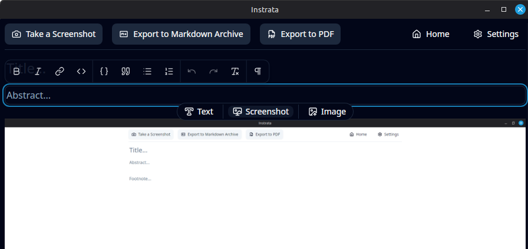

# instrata

> Instrata is a tool for creating step-by-step guides from automatic screenshots.  



[](https://github.com/instrata/instrata/actions/workflows/build+release.yml)
[](https://github.com/instrata/instrata/actions/workflows/github-code-scanning/codeql)
[](https://github.com/instrata/instrata)
[](https://github.com/instrata/instrata)
[](LICENSE)

## Why Instrata

Instrata is built for anyone who needs fast, clean documentation of workflows.  
It helps you quickly capture, organize, and share processes without manually taking and sorting screenshots. Screens are captured automatically, then you can annotate, highlight, or blur content and export guides in multiple formats. This saves time and improves clarity when creating step-by-step documentation.

## Key Features

- Automatic screenshot capture for step-by-step guides
- Multi-format export: images, Markdown, HTML, PDF, JSON project files
- Simple image editing: blur, highlight, text, basic adjustments
- Hotkeys and system tray support
- Minimalist, modern UI
- Focused on ease-of-use and workflow efficiency

## Installation

Download the latest release for your platform from [GitHub Releases](https://github.com/instrata/instrata/releases).

**Linux:** `.AppImage`, `.deb`, `.rpm`  
**Windows:** `.msi` or `-setup.exe`  
**MacOS:** `.dmg`

> [!WARNING] ⚠️ Note on installation warnings:  
> Instrata is an open-source project and does not have the resources to sign binaries.  
> This means that on **Windows** or **macOS** you may see warnings when running the installer or application for the first time.  
> These warnings are expected and do not indicate malware. You can choose to proceed with the installation if you trust the source (the official Instrata GitHub releases).

### Installation Notes Linux

```bash
# Debian / Ubuntu
sudo dpkg -i instrata-x.y.z.deb

# Fedora / RHEL
sudo rpm -i instrata-x.y.z.rpm

# AppImage (any distro)
chmod +x instrata-x.y.z.AppImage
./instrata-x.y.z.AppImage
```

### Installation Notes macOS
For **macOS**, open the `.dmg`, then drag **Instrata** into Applications.

## Samples

Instrata comes with sample guides to help you get started quickly. Check the [sample guides directory](README.assets/sample-guides) for ready-to-use examples and inspiration.

<!--

-->

## Contributing

Contributions are welcome. You can help in several ways:

- **Bug reports & feature requests:** Open an issue with a clear description and steps to reproduce. Include screenshots when relevant.
- **Code contributions:** Fork the repository, implement your changes in a separate branch, and submit a pull request. Follow existing code style and include documentation for new features.
- **Documentation & examples:** Improve guides, add sample projects, or clarify existing instructions.
- **Testing & feedback:** Test new releases, report inconsistencies, and provide feedback to improve usability.

All contributions help make Instrata more stable, feature-rich, and user-friendly. Please follow the contribution guidelines and be respectful of the community.

## License

This project is licensed under **GPL-3.0**. See [LICENSE](LICENSE) for details.  
GPL-3.0 ensures contributions remain free and open. Compatible with most free/open-source licenses.
